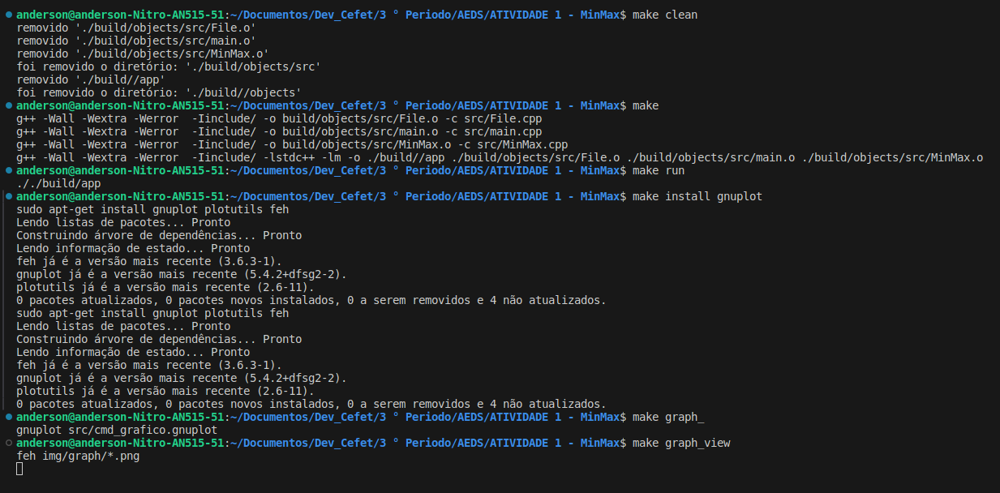
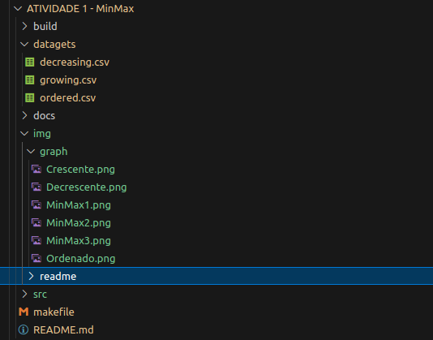

    <h1 >Atividade 1: Avaliação dos Algoritmos Minimax </h1>
    Anderson Rodrigues dos Santos   
    Docente Michel Pires Da Silva   
    Cetef-MG <i>Campus</i> Divinópolis

    <h2>Introdução </h2>
    

        A avaliação consiste na criação de um código que realiza uma comparação de 3 implementações discutida na sala de aula o MinMax1, MinMax2 e MinMax3. A ideia geral discutida, é visualizar o melhor custo computacional quando é submetido uma vetor de diferentes tamanhos e método de  aplicação (ordenado, crescente e decrescente).
    

    <h2>Desenvolvimento </h2>
    

        O planejamento do código teve a utilização da linguagem C++ e a implementação dos três algoritmos o MinMax1, MinMax2 e MinMax3 imposto pelo professor <a href="docs/Mimmax.pdf">[1]</a>.
    

    <h3> Avaliação das Métodos</h3>
    <ol>
        <li>
        Utilização de diferentes tamanhos de entrada: 1000, 10.000, 100.000 e 500.000. Esses conjunto de dados deve ser gerado com valores variados entre 0 a 1000.
        </li>
        <li> 
            Cada algoritmo Minimax deve ser executado 10 vezes para cada tamanho de entrada. O tempo de execução obtido será a média dessas 10 execuções. 
        </li>
        <li>
            O mesmo conjunto de dados inicial deve ser utilizado para todas as avaliações de um determinado tamanho N de valores. Além disso, considere utilizar os mesmos dados para compor suas variações ordenadas, crescente e decrescente. 
        </li>
        <li>
            Elaboração uma planilha  e Gráficos:
            <ul>
                <li>
                    Elaborar uma planilha Excel para analisar as relações de tempo de forma de gráfica.
                </li>
                <li>
                    Recomendação: Utilizar o gnuplot para plotar os gráficos e disponibilizar o script junto com código no git.
                </li>
            </ul>
        </li>
        <li>
            Disponibilização do Código no Git.
        </li>
    </ol>
    <h3>Implementação do Código</h2>
        <h4>Arquivos</h4>
        <ul>
            <li>
                <b>src/</b> 
                <ol>
                    <li>
                        <b>File.cpp e File.hpp</b> 
                         
                            Arquivos responsáveis de criar e escrever nas planilhas.   
                            - Funções e Variáveis: 

    private:
        string output_ordered, output_growing, output_decreasing;  //Guarda os endereço dos arquivos;

    public:
        File();  //Construtor da Classe, responsável por cria as planilhas
    
        void FileOrdered(int size, int mm1, int mm2, int mm3);
        void FileDecreasing(int size, int mm1, int mm2, int mm3);
        void FileGrowing(int size, int mm1, int mm2, int mm3);
        //As funções FileOrdered, FileDecreasing e FileGrowing são responsáveis por escrever os valores nos arquivo de linha por linha 

                         
                    </li>
                    <li>
                        <b>MinMax.cpp e File.hpp</b> 
                        São arquivos que tem função de executar os três algoritmos(  MinMax1, MinMax2 e MinMax3) e descobrir o tempo médio que cada um exerce em relação ao método de aplicação.  
                        - Funções e Variáveis: 

    private:
        vector <int> min_max; //Garda os elementos( 0 a 1000),
        int size; //Guarda o tamanho do vetor

        //As Funções MinMax1, MinMax2 e MinMax3 retornam o tempo gasto na execução em nanosegundos(ms)
        long MinMax1();
        long MinMax2();
        long MinMax3();

        void growingMinMax(); // Função responsável  por organizar em ordem crescente os elementos do vetor
        void decreasingMinMax(); // Função responsável  por organizar em ordem decrescente os elementos do vetor

    public:
        // As funções MinMax, são responsáveis por determinar o tamanho  do vetor e guardar o número do tamanho diretamente
        MinMax(); 
        MinMax(int size);

        void run(File *file, int repeat = 10); // É a função principal que gerencia as funções MinMax1,2 e 3, growingMinMax e decreasingMinMax. Além de gerenciar, também é responsável por calcular a media do tempo e enviar para escrever nas planilhas pelas funções do aquivo File.cpp/.hpp

        void generate(); //Função responsável por gerar os números para o vetor de 0 a 1000 aleatoriamente
        void setSize(int size); //setar um novo tamanho

 
                    </li>
                    <li>
                    <b>main.cpp</b> 
                    É o aquivo principal, que chama as funções construtoras para direcionar o funcionamento do código.
                    </li>
                     
                    <li>
                        <b>cmd_grafico.gnuplot</b> 
                        É o script responsável por plotar os gráficos com base nos dados dos arquivos de saída.
                    </li>
                </ol>
            </li>
             
            <li>
                <b>datasets/</b>
                <ol>
                    <li>
                        <b>decreasing.csv, growing.csv e ordered.csv</b> 
                        São os arquivos de Excel que recebe os dados, como o tamanho e tempo médio de cada execução do código. 
                    </li>
                </ol>
            </li>
             
            <li>
                <b>img/</b>
                <ol>
                    <li>
                        <b>graph</b> 
                        Recebe as imagens dos gráficos
                    </li>
                    <li>
                        <b>readme</b> 
                        São imagens que são utilizados no README.md
                    </li>
                </ol>
            </li>
        </ul>
    <h2>Execução e Explicação em um exemplo</h2>
    
As Figura 1, mostra a submissão dos comandos de maneira ideal,  seguindo essa sequencia a chance de erro é mínimo, e também é necessário ter o sistema operacional da familia Linux para o funcionamento do código, como é mostrado na figura 4.

    

        
        
Figura 1: Serie de comandos para a execução do código

    

    <dr>
    
A Figura 2, é o resultado que ocorre ao submeter os comando de maneira ideal, na imagem vemos uma aba que mostra os gráficos, para mudar para próximo gráfico há duas maneiras: A primeira é clicando na imagem e segunda é rolar o scroll do mouse.

    

        
        
Figura 2: A visualização das imagens dos gráficos depois do comando <i>make graph_view</i>

    

     
    
A figura 3 mostra o resultado final dos arquivos. Na pasta <i>datagets</i> fica os arquivos das planilhas criadas e a pasta <i>img/graph</i> ficam as imagens dos gráficos gerados.

    

        
        
Figura 3: Resultado final

    

      
    

        
        
Figura 4: Configurações do computador utilizado na compilação do programa

    

 
    <h2>Referencia</h2>
    

    <a href="docs/Mimmax.pdf">[1] - Documento da proposta da atividade</a> 
    https://learn.microsoft.com/pt-br/cpp/cpp/?view=msvc-170
    

## Compilação e Execução
O projeto disponibilizado possui um arquivo Makefile que foi disponibilizado pelo professor Michel e modificado para realiza todo o procedimento de compilação e execução. Para tanto, temos as seguintes diretrizes de execução:

|Comando 	    |Função                                                                                  |
|---------------|----------------------------------------------------------------------------------------|
|make clean     |Apaga a última compilação realizada contida na pasta build                              |
|make 	        |Executa a compilação do programa utilizando o gcc, e o resultado vai para a pasta build |
|make run 	    |Executa o programa da pasta build após a realização da compilação                       |
|make install gnuplot |Instala as extensões necessárias para o funcionamento do script gnuplot (uma vez já instalado não necessita mais a submissão)|
|make graph_    |Executa o script do gnuplot para criação dos gráficos|
|make graph_view |Mostra as imagens dos gráficos |

### _Observação e Atenção_
É necessário que submeta uma vez o _make install gnuplot_ antes de submeter 
o _make graph__ ou  _make graph_view_

A tabela em cima ja esta na ordem ideal para o funcionamento sem problemas do programa.

 